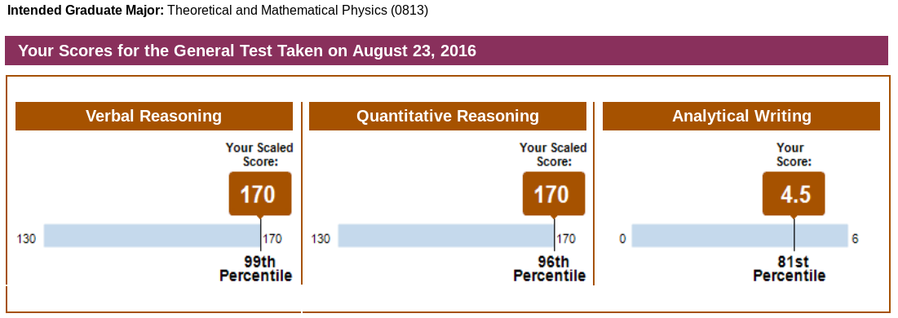
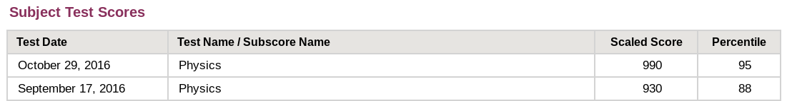

### My Test Prep Scores

My most recent experience with standardized testing was in preparation for PhD program applications. I prepped for the GRE and the GRE Physics Subject Test using the skills I learned as a tutor. Here were my results.

The GRE Physics exam has a maximum scaled score of 990. 