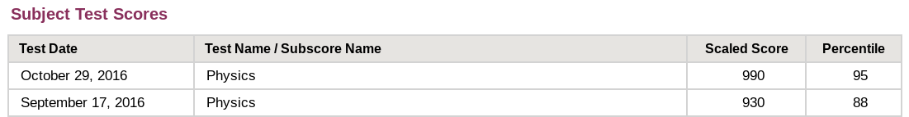

I love to learn and love to teach! Below I've detailed my experience and subjects. At this time I am only taking students local to Seattle. Please be in touch with any inquiries. Thank you!

### Experience

I began instructing in 2010 with Revolution Prep as a SAT and ACT classroom instructor, eventually reaching over a thousand students at multiple high schools and centers in the SF Bay Area. I received accolades as a strong and understanding instructor when I worked at Revolution Prep and then later at the Elite Education Institute. Now at the University of Washington, I teach all levels of physics. My performance earned me a First Year Teaching Award. I also volunteer as a <a href="https://carpentries.org/">Software Carpentries</a> instructor.

More detailed background is available on my resume and on <a href="https://www.linkedin.com/in/ssahba/">my LinkedIn</a>.

### Subjects

I specialize in applied math and physics, as well as instructing comprehensive test prep. Below is a list of topics where I have teaching experience. Reach out if there's something not on the list, so I can make a recommendation. Thanks!

**Test Prep**: ACT, SAT, *SAT Subject Tests* (Mathematics 2, Chemistry, Physics), *AP Exams* (Psychology, Calculus AB, Calculus BC, Statistics, Physics 1, Physics 2, Physics C), GRE, *GRE Subject Test* (Physics)

**Mathematics**: Geometry, Precalculus, Calculus, Multivariate Calculus, Ordinary Differential Equations, Partial Differential Equations, Linear Algebra, Probability, Statistics

**Physics**: Introductory Physics, Classical Mechanics, Electromagnetism, Statistical Mechanics, Thermodynamics, Quantum Mechanics

**Computational**: UNIX Shell (Bash), Git, Python, MATLAB, Mathematica

### My Test Prep Scores

<!-- <a href="./scores.html">My Test Prep Scores</a> -->

My most recent experience with standardized testing was in preparation for PhD program applications. I prepped for the GRE and the GRE Physics Subject Test using the skills I learned as a tutor. Here were my results.

The GRE Physics exam has a maximum scaled score of 990. 
